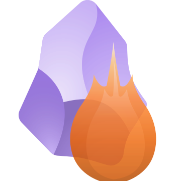

<p align="center">
  
</p>

<h3 align="center">The most capable MCP server for Obsidian.</h3>

<p align="center">
  <strong>20 tools</strong> · Canvas with auto-layout · BM25 smart search · Vault intelligence<br/>
  No Obsidian plugin required · Works on macOS, Linux, Windows
</p>

<p align="center">
  <a href="#canvas-tools">Canvas</a> ·
  <a href="#smart-search">Search</a> ·
  <a href="#vault-intelligence">Intelligence</a> ·
  <a href="#all-tools">All 20 Tools</a> ·
  <a href="#quick-start">Quick Start</a>
</p>

---

## The Problem with Every Other Obsidian MCP

I checked them all — mcp-obsidian, mcpvault, obsidian-mcp-server, obsidian-mcp-tools, obsidian-mcp-plugin. They read files. They write files. Some search. That's it.

None of them can create a visual diagram. None of them rank search results by relevance. None of them can tell an agent *"here are the 12 themes in this vault and which files belong to which."*

obsidian-forge does all three.

| Feature | obsidian-forge | mcp-obsidian | mcpvault | obsidian-mcp-server |
|---------|:-:|:-:|:-:|:-:|
| Read / Write / Delete notes | ✅ | ✅ | ✅ | ✅ |
| Full-text search | ✅ | ✅ | ✅ | ✅ |
| Edit in-place | ✅ | ❌ | ✅ | ❌ |
| Batch operations | ✅ | ❌ | ❌ | ❌ |
| Daily notes | ✅ | ❌ | ❌ | ✅ |
| Vault stats | ✅ | ❌ | ✅ | ❌ |
| **Canvas — create with auto-layout** | ✅ | ❌ | ❌ | ❌ |
| **Canvas — semantic read** | ✅ | ❌ | ❌ | ❌ |
| **Canvas — patch (add/remove/update)** | ✅ | ❌ | ❌ | ❌ |
| **Canvas — re-layout (dagre)** | ✅ | ❌ | ❌ | ❌ |
| **BM25 smart search (Orama)** | ✅ | ❌ | ❌ | ❌ |
| **Vault theme mapping (TF-IDF)** | ✅ | ❌ | ❌ | ❌ |
| **Vault reorganization engine** | ✅ | ❌ | ❌ | ❌ |
| No Obsidian plugin required | ✅ | ❌ | ✅ | ❌ |

---

## Three Things No Other MCP Can Do

### 🎨 Canvas Tools

> The agent thinks in graphs. The tool thinks in pixels.

AI agents create, read, modify, and re-layout [JSON Canvas](https://jsoncanvas.org/) files without touching a single coordinate. The agent describes a semantic graph. obsidian-forge calculates all geometry using [dagre](https://github.com/dagrejs/dagre) — the same Sugiyama layout engine behind Mermaid and React Flow.

**canvas_create** — describe nodes and edges, get a fully laid-out `.canvas` file:

```
Agent sends:                              Obsidian renders:
                                          
  nodes:                                  ┌───────────┐
    - API Gateway                         │    API    │───┐
    - Auth Service                        │  Gateway  │   │
    - Database                            └───────────┘   │
    - Cache                               ┌───────────┐   │   ┌───────────┐
  edges:                                  │   Auth    │───┼──▶│ Database  │
    - API Gateway → Auth Service          │  Service  │   │   └───────────┘
    - API Gateway → Cache                 └───────────┘   │
    - Auth Service → Database                             │   ┌───────────┐
    - Cache → Database                                    └──▶│   Cache   │
  layout: { direction: "LR" }                                 └───────────┘
```

**canvas_read** — semantic graph, not raw JSON:

```
Instead of:  {"id":"231bf38f","x":-635,"y":-420,"width":250,"height":70,...}
Agent gets:  { label: "AXON", connections: ["Strategy", "AWS", "Resistance"] }
```

**canvas_patch** — modify with relative positioning:

```
add_nodes: [{ label: "New Module", near: "API Gateway", position: "below" }]
remove_nodes: ["Deprecated Service"]  →  cascade-removes all connected edges
```

**canvas_relayout** — fix a messy canvas with one call. Preview before committing.

---

### 🔍 Smart Search

> Not grep. Elasticsearch-grade.

[Orama](https://github.com/oramasearch/orama) BM25-ranked search with typo tolerance, stemming (26 languages), and field boosting. No ML, no API keys, no internet.

```
smart_search("stripe webhook")

  → Stripe-Webhooks.md             score: 0.92
    "...webhook endpoint configuration for handling Stripe events..."
  
  → Refactor-Prompts.md            score: 0.61
    "...refactor the Stripe integration to use webhook signatures..."

vs search_content("stripe webhook")
  → Returns EVERY file containing "stripe", unranked, no scoring
```

**Field boosting:** title (3×) > tags (2.5×) > headings (2×) > content (1×).

**Persistent index** at `.obsidian-forge/search-index.json` — survives restarts.

---

### 🧠 Vault Intelligence

> Your vault has folders. Now it has a map.

Files land where the energy of the moment puts them. Themes bleed across folders — "SpecForge" ends up in `Projetos/`, `AI/prompts/`, `Content/`, and `Empresas/`. Nobody maintains a perfect taxonomy.

**vault_themes** — scans every file, extracts distinctive terms via TF-IDF, clusters by similarity:

```json
{
  "themes": [
    {
      "label": "SpecForge Frontend",
      "key_terms": ["impl", "dashboard", "widget"],
      "files": 12,
      "folders": ["32-AI/prompts/specforge"],
      "coherence": 0.89
    },
    {
      "label": "Content Strategy",
      "files": 6,
      "folders": ["80-Content", "70-Empresas"],
      "cross_folder": true
    }
  ],
  "orphans": 5,
  "cross_folder_warnings": 3
}
```

**vault_suggest** — actionable reorganization from the atlas:

```json
{
  "suggestions": [
    { "type": "consolidate", "action": "Move Launch-Strategy.md → 80-Content/" },
    { "type": "create_moc", "action": "Create MOC-SpecForge-Frontend.md linking 12 files" },
    { "type": "archive", "action": "Move 8 stale files to 90-Archive/" }
  ]
}
```

**The full workflow:**

```
"Organize my vault"
  → vault_themes()      maps 179 files into 15 themes
  → vault_suggest()     generates 20 reorganization actions  
  → human approves      "do it, skip the archive stuff"
  → batch execution     moves files, creates MOCs
  → canvas_create()     visual theme map in Obsidian
```

The vault maps itself.

---

## All Tools

### Notes (5)
| Tool | What it does |
|------|-------------|
| `read_note` | Read content + metadata. Fuzzy path resolution. |
| `write_note` | Create or overwrite. |
| `edit_note` | In-place find and replace. |
| `append_note` | Append to existing, or create if missing. |
| `delete_note` | Move to `.trash` (safe) or permanent. |

### Search & Discovery (8)
| Tool | What it does |
|------|-------------|
| `smart_search` | **BM25-ranked.** Typo tolerance, field boosting, snippets. |
| `search_reindex` | Force re-index after bulk operations. |
| `search_vault` | Fast filename/path search from in-memory index. |
| `search_content` | Full-text grep. For exact/literal matches. |
| `list_dir` | Directory listing with glob filtering. |
| `recent_notes` | Recently modified files. Instant from index. |
| `daily_note` | Today's daily note (or any date). |
| `vault_status` | File counts, types, index health. |

### Canvas (4)
| Tool | What it does |
|------|-------------|
| `canvas_create` | Semantic graph → auto-laid-out `.canvas` via dagre. |
| `canvas_read` | Canvas → semantic graph (labels + connections, not coordinates). |
| `canvas_patch` | Add/remove/update with relative positioning + fuzzy matching. |
| `canvas_relayout` | Re-layout existing canvas. Preview before committing. |

### Intelligence (2)
| Tool | What it does |
|------|-------------|
| `vault_themes` | TF-IDF theme extraction + clustering. Vault atlas with cross-folder warnings. |
| `vault_suggest` | Reorganization engine: consolidate, create MOCs, archive stale, triage orphans. |

### Batch (1)
| Tool | What it does |
|------|-------------|
| `batch` | Execute multiple operations in a single call. |

---

## Quick Start

### Prerequisites

- [Node.js](https://nodejs.org/) v18+
- A folder with Markdown files (Obsidian vault or any structure)

**Obsidian app is not required.** obsidian-forge operates directly on the filesystem. If Obsidian is open, it picks up changes in real time.

### Install

```bash
npm install -g obsidian-forge
```

### Configure

**Claude Desktop** — add to `claude_desktop_config.json`:

macOS / Linux:
```json
{
  "mcpServers": {
    "obsidian-forge": {
      "command": "obsidian-forge",
      "args": ["/Users/you/Documents/MyVault"]
    }
  }
}
```

Windows:
```json
{
  "mcpServers": {
    "obsidian-forge": {
      "command": "obsidian-forge",
      "args": ["C:\\Users\\you\\Documents\\MyVault"]
    }
  }
}
```

**Claude Code:**

```bash
claude mcp add obsidian-forge -- obsidian-forge /path/to/your/vault
```

### Verify

Ask your AI assistant: *"List the files in my vault"* — if it responds with your vault contents, you're connected.

---

## Under the Hood

### Three Engines, One Index

```
@orama/orama (BM25 index — single source of truth)
  ├── smart_search      query-driven    "find files about X"
  ├── vault_themes      corpus-driven   "what themes exist?"
  └── vault_suggest     action-driven   "how should I reorganize?"

@dagrejs/dagre (Sugiyama graph layout)
  ├── canvas_create     semantic graph → positioned canvas
  ├── canvas_patch      relative edits → absolute coordinates
  └── canvas_relayout   messy canvas → optimized layout
```

### Dependencies

Two packages. Both MIT, TypeScript-native, zero sub-dependencies:

| Package | Purpose | Size |
|---------|---------|------|
| [`@dagrejs/dagre`](https://github.com/dagrejs/dagre) | Sugiyama graph layout | ~15KB |
| [`@orama/orama`](https://github.com/oramasearch/orama) | BM25 search engine | ~2KB core |

### Architecture

```
src/
├── tools/
│   ├── notes/                  read, write, edit, append, delete
│   ├── search/                 search_vault, search_content, list_dir, recent, daily, status
│   │   ├── smart-search.ts           BM25 search via Orama
│   │   ├── search-reindex.ts         full/incremental re-index
│   │   ├── orama-engine.ts           Orama wrapper + persistence
│   │   └── markdown-parser.ts        strip md, extract frontmatter/headings
│   ├── intelligence/           vault analysis + reorganization
│   │   ├── vault-themes.ts           TF-IDF extraction + clustering
│   │   └── vault-suggest.ts          suggestions + batch execution
│   ├── canvas/                 JSON Canvas (jsoncanvas.org spec v1.0)
│   │   ├── canvas-create.ts
│   │   ├── canvas-read.ts
│   │   ├── canvas-patch.ts
│   │   ├── canvas-relayout.ts
│   │   ├── layout-engine.ts          dagre wrapper + edge side calc
│   │   ├── canvas-utils.ts           ID gen, text height, fuzzy match
│   │   └── types.ts
│   └── batch/                  multi-operation execution
```

---

## The Forge is Open

obsidian-forge is the first open-source tool from the **Blacksmithers** — a community of builders who forge tools that build things.

We don't wrap APIs and call it innovation. We build real engines — BM25 search, graph layout, TF-IDF clustering — because the tools AI agents use should be as rigorous as the agents themselves.

**If that resonates, you're already one of us.**

### Contributing

Open an issue first to discuss changes. PRs welcome — especially for:

- New language stemmers for smart search
- Canvas layout algorithms beyond Sugiyama
- Intelligence tools (backlink analysis, MOC generation, etc.)
- Performance improvements for large vaults (10k+ files)

### Community

- 🔨 [blacksmithers.dev](https://blacksmithers.dev) — The movement
- 🐦 [@gabgforge](https://x.com/gabgforge) — Engineer · Founder · Blacksmither
- 💬 [GitHub Discussions](https://github.com/solutions-forge/obsidian-forge/discussions) — Ideas, feedback, show & tell

### License

[MIT](LICENSE) — [Solutions Forge LTDA](https://solutionsforge.tech)

---

<p align="center">
  <strong>Stop automating spreadsheets. Start forging.</strong>
</p>